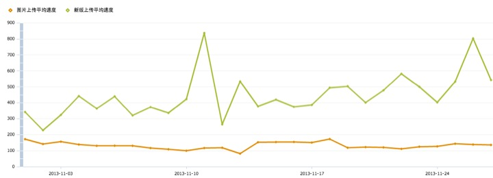
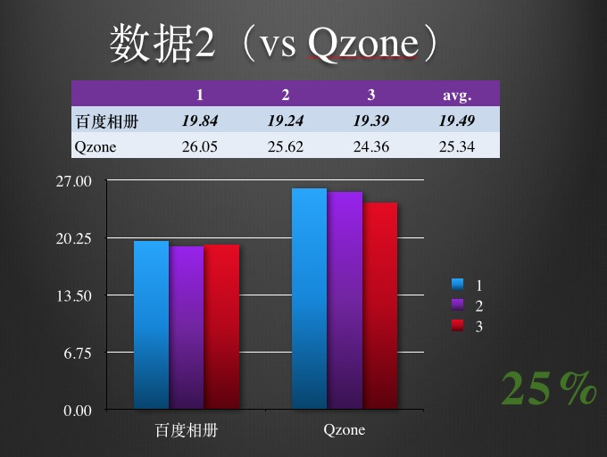
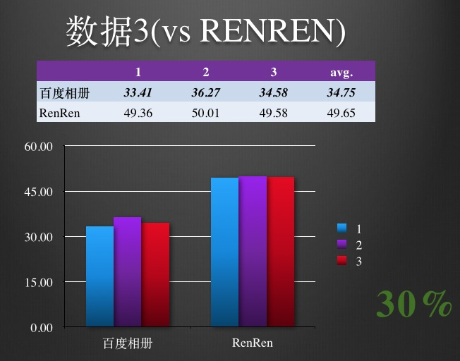

# Webuploader文件上传
Webuploader是一个以html5为主的现代多文件上传js库，比传统FLASH文件上传具有更高的上传效率、图片处理能力以及更低的内存消耗，同时结合HTML5 File API使得Webuploader具有了更加丰富的文件交互体验。目前已应用在百度相册上传页中，承载着海量的用户上传。

以下是云相册新老版本平均上传速度对比图。

以下是与其他竞品的数据对比，更多对比请[点击这里](https://github.com/gmuteam/webuploader/tree/master/_docs/compare/lateral)。

以下将详细介绍webuploader有哪些特性。

## 特性

### 多途径文件选择
支持文件多选，文件类型过滤，文件拖拽，图片粘贴功能。粘贴功能的作用主要体现在当有图片数据在剪切板中时（截屏工具如QQ(Ctrl + ALT + A), 网页中右击图片点击复制），可以再选中页面Ctrl + V来添加此图片文件。

### 分片并发上传
分片与并发结合，可以将一个大文件分成多块，并发上传，极大地提高大文件的上传速度。同时当莫名的网络问题导致传输错误时，只需要重传出错片段，而不是整个文件。另外分片传输，能够更加实时的跟踪上传进度。

结合md5，分片还可以用来做断点续传，在传输之前将文件md5发给服务端获取上传信息，按需上传。

### 文件预览与压缩
上传前图片预览，可以更加快速的将用户选择呈现出来，提高用户体验。支持常用的图片格式，如jpg,jpeg,gif,bmp,png, 另外还可以支持pdf预览。

图片高质量压缩，很多情况下用户选择都是相机拍摄的原始文件，像这类文件都有着很大的压缩空间，以往只能用类似ps这样的软件处理后上传，现在可以通过webuploader直接压缩后上传来节省上传流量和时间。

webuploader还对jpeg图片预览做了更大的支持，她能正确解析jpeg中的meta信息，对与各种orientation做了正确的处理。另外压缩后上传保留了图片的所有meta数据。

### HTML5 + FLASH 双核支持
考虑到html5覆盖率不够, Webuploader内部统一接口，实现了两套运行时支持, 基本上支持大部分的浏览器。
同时对外的接口也是统一的，用户不用关心内部用了什么内核。同时Flash部分没有做任何UI相关的事情，连队列管理都没有，方便不愿意关心flash的用户扩展和自定义业务需求。

### Md5秒传
如果上传的文件体积比较大，量比较多，webuploader提供上传前先做文件md5值验证功能，如果文件验证通过，可直接跳过上传。

如果服务端与前端统一修改算法取段部分md5可以提高更高的验证性能，耗时在20ms左右。

### 易扩展
Webuploader采用插件机制, 将各个功能独立成了插件，可自由选择包含或不包含。另外用command模式开放了多个hook供外部扩展。

