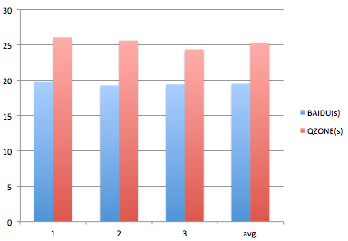
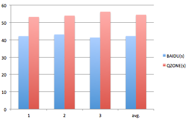
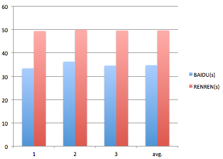
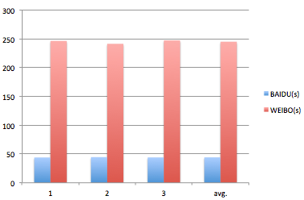

云相册横向评测
==============

##目标站点
百度云相册、QZONE相册、RENREN相册、WEIBO相册（国外网站由于网络原因暂未加入）。

##样本图片
100K 300K 500K 800K 1M 3M 5M 10M 8种大小图片各10张，共计80张212.20M (见 [http://t.cn/zRVry4T](http://t.cn/zRVry4T) )。

##网络环境
自家宽带，联速网络10M（联通）。

##测试方式
在相同环境下（网络、系统、浏览器），分别依次在QZONE、RENREN、WEIBO上批量上传样本图片，其中QZONE区分普通和高清图片，其他不区分，各测试3次计算总上传时间，求平均值。

由于各个目标站点的图片压缩参数不一致，在百度云相册上传时会分别重新设置压缩参数，确保上传后图片大小以及质量与目标站点一致，各测试3次计算总上传时间，求平均值。

##测试结果

###云相册 VS QZONE相册

普通上传（800 * 800 80%）

<table>
    <tr>
        <th></th><th>1</th><th>2</th><th>3</th><th>avg.</th>
    </tr>
    <tr>
        <th>BAIDU(s)</th><td>19.84</td><td>19.24</td><td>19.39</td><td>19.49</td>
    </tr>
    <tr>
        <th>QZONE(s)</th><td>26.05</td><td>25.62</td><td>24.36</td><td>25.34</td>
    </tr>
</table>

云相册HTML5上传比QZONE相册快 23.08%

高清上传（1600 * 1600 95%）

<table>
    <tr>
        <th></th><th>1</th><th>2</th><th>3</th><th>avg.</th>
    </tr>
    <tr>
        <th>BAIDU(s)</th><td>42.11</td><td>43.06</td><td>41.29</td><td>42.15</td>
    </tr>
    <tr>
        <th>QZONE(s)</th><td>53.19</td><td>53.91</td><td>56.17</td><td>54.42</td>
    </tr>
</table>

云相册HTML5上传比QZONE相册快 22.50%

###云相册 VS RENREN相册

1024*1024 80%

<table>
    <tr>
        <th></th><th>1</th><th>2</th><th>3</th><th>avg.</th>
    </tr>
    <tr>
        <th>BAIDU(s)</th><td>33.41</td><td>36.27</td><td>34.58</td><td>34.75</td>
    </tr>
    <tr>
        <th>RENREN(s)</th><td>49.36</td><td>50.01</td><td>49.58</td><td>49.65 </td>
    </tr>
</table>

云相册HTML5上传比RENREN相册快 30%

###云相册 VS WEIBO相册

2048*2048 93%

<table>
    <tr>
        <th></th><th>1</th><th>2</th><th>3</th><th>avg.</th>
    </tr>
    <tr>
        <th>BAIDU(s)</th><td>43.96</td><td>44.59</td><td>44.05</td><td>44.20</td>
    </tr>
    <tr>
        <th>WEIBO(s)</th><td>246.46</td><td>241.4</td><td>247.31</td><td>245.06</td>
    </tr>
</table>

云相册HTML5上传比WEIBO相册快 近5倍

