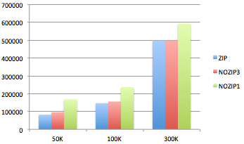
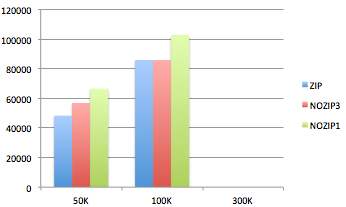
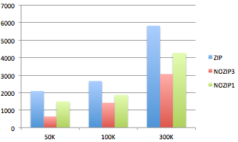

文件批量上传ZIP方案调研
====================

##介绍

利用HTML5的新接口例如`ArrayBuffer`、`Blob`等可以在前端进行zip操作并且可以将zip后的文件上传到服务器。本调研主要关注zip方案的zip效率以及整体上传效率。

##工具

 * zip方案来自 [http://gildas-lormeau.github.io/zip.js/](http://gildas-lormeau.github.io/zip.js/)；
 * 使用Network Link Conditioner模拟各种网络环境：2G/3G/wifi等；

##维度

 * 网络环境:2G & 3G & wifi
 * 图片大小:50K & 100K & 300K
 * 并发数：1 & 3（仅针对NOZIP方案）
 * 图片数量：30

##方案

ZIP方案：上传前采用前端ZIP方法将所有文件打包成一个文件后使用AJAX上传，需记录打包时间和上传时间；
NOZIP方案：采用并行1或3个AJAX请求的方式批量上传所有的图片；

##数据

###2G

使用Network Link Conditioner模拟2G环境，上传速度在15K/S左右，每个请求建立连接的时间在1s左右；

<table>
<tr><th>方案</th><th>  50K</th><th> 100K</th><th>    300K</th></tr>
<tr><th>ZIP</th><td> 82285</td><td>   146951</td><td>  498930</td></tr>
<tr><th>NOZIP1</th><td>   168294</td><td>   236620</td><td>  592867</td></tr>
<tr><th>NOZIP3</th><td>   96198</td><td>   156123</td><td>  499195</td></tr>
</table>

2G网络中只保持1个请求的情况下，ZIP方案具有绝对的优势，尤其在图片大小小于100K时。

2G网络中同时开启3个请求的情况下，当图片大小小于100K时ZIP方案有比较明显的优势，但是随着图片尺寸的增加这种优势逐渐消失。
ZIP方案的优势在于将N个请求合并成1个，因此有效减少了每个请求中除去上传数据之外的额外时间，例如连接建立等。

对于非ZIP方案而言，在图片尺寸较小时，每个请求中非图片上传的时间占更大的比例，因此ZIP方案的优势得以突显，而随着图片尺寸的增加，每个请求中非图片上传时间的比例也在下降，因此ZIP方案没有明显优势。

此外，与串行请求相比，在2G环境中使用并行请求仍然能获得优势，例如在串行时NOZIP方案上传30张50K图片耗时约181878ms，与3个请求并行相比慢了约1倍。原因在于并行时请求建立连接以及服务器端的处理都是并发的，而不像串行时所有前端和后端的处理均为线性。

请求数据：
通过Chrome开发者工具看到的每个请求包括：

 * DNS Lookup:  Time spent performing the DNS lookup. You want to minimize DNS look ups.
 * Connecting:  Time it took to establish a connection, including TCP handshakes/retries, DNS lookup, and time connecting to a proxy or negotiating a secure-socket layer (SSL).
 * Sending: Time spent sending the request.
 * Waiting: Time spent waiting for the initial response.
 * Receiving:   Time spent receiving the response data.

以上的解释似乎都理所应当，但查看实际的数据时仍然会有令人困惑之处，主要集中在`Sending`和`Waiting`。

例如以下是一个2G环境中上传50K图片时的请求数据：
 * DNS Lookup：0
 * Connecting：850ms
 * Sending：0
 * Waiting：5.54s
 * Receiving：0

例如以下是一个2G环境中上传1.2M图片时的请求数据：
 * DNS Lookup：0
 * Connecting：846ms
 * Sending：47.3s
 * Waiting：5.54s
 * Receiving：0

例如以下是一个wif环境中上传50K图片时的请求数据：
 * DNS Lookup：0
 * Connecting：5ms
 * Sending：0
 * Waiting：24ms
 * Receiving：0

例如以下是一个wif环境中上传300K图片时的请求数据：
 * DNS Lookup：0
 * Connecting：4ms
 * Sending：189ms
 * Waiting：22ms
 * Receiving：0

从数据可以看出，`Waiting`并不是纯服务器端处理时间，它与网速有直接关系，wifi下的`Waiting`时间是接近真实的服务器端处理时间的。
但同时`Waiting`时间与文件大小是无关的，无论50K还是1.2M都基本一致。
初步猜想`Waiting`包括一部分浏览器处理文件上传的时间，否则在15K/S的上传速度下，50K文件的`Sending`时间不应该是0。
此外，`Sending`时间与AJAX中progress监控的时间保持一致。

综上所述，2G环境下基本可以将`Sending` + `Waiting`视为总的前端上传时间，服务器端真实处理时间基本在ms级别。

###3G

<table>
<tr><th>方案</th><th>50K</th><th>100K</th><th>300K</th></tr>
<tr><th>ZIP</th><td>48273</td><td>85866</td><td>-</td></tr>
<tr><th>NOZIP1</th><td>66510</td><td>102841</td><td>-</td></tr>
<tr><th>NOZIP3</th><td>56889</td><td>85837</td><td>-</td></tr>
</table>

与2G类型，3G网络环境下，ZIP方案依旧在批量小图片的上传中保持一定的优势，包括多请求并发方案。但是一旦图片大小达到100K左右就不再具有优势。

###WIFI

<table>
<tr><th>方案</th><th>50K</th><th>100K</th><th>300K</th></tr>
<tr><th>ZIP</th><td>2091</td><td>2663</td><td>5821</td></tr>
<tr><th>NOZIP1</th><td>1499</td><td>1871</td><td>4271</td></tr>
<tr><th>NOZIP3</th><td>641</td><td>1418</td><td>3061</td></tr>
</table>

WIFI环境下ZIP不具备优势，相反，当文件增大时打包时间的比例会很大，因此整体速度反而变慢。

##结论

 * ZIP方案适用于网络速度较低（例如2G/3G）以及文件较小（小于100K）时的批量上传场景；
 * 2G/3G环境下并发请求仍然能获得比较大的上传优势；（在2G/3G环境下可以结合ZIP以及并发请求来进一步提供上传速度）

